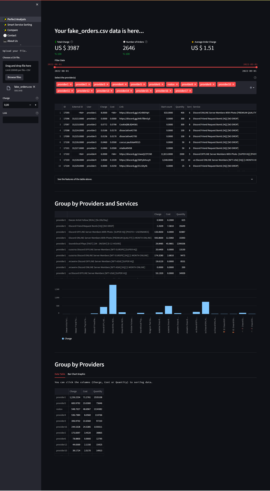
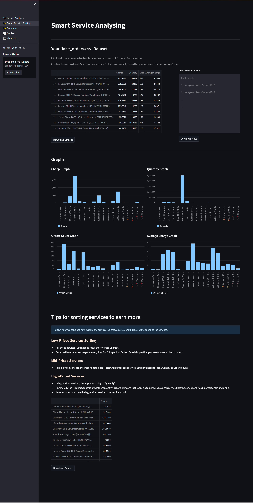
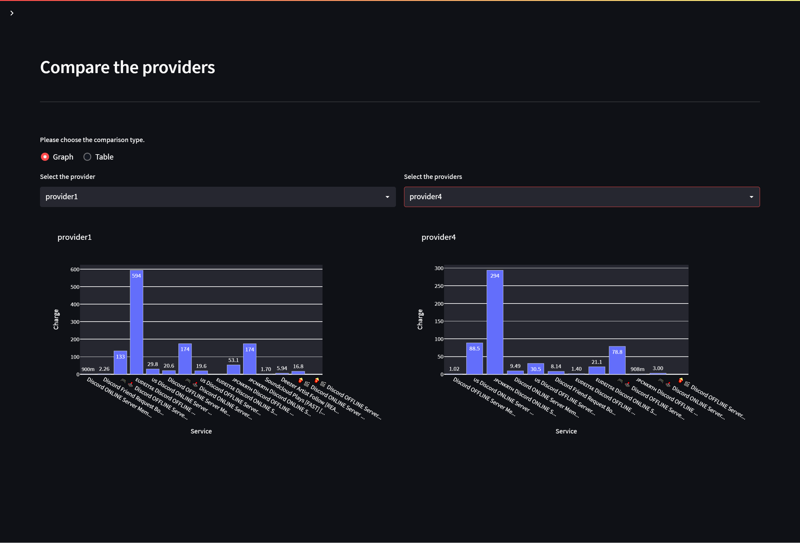
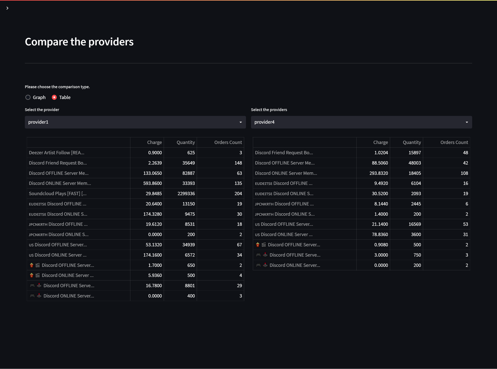

# Streamlit Pandas Analysing Project

## Requirements
- matplotlib==3.5.3
- numpy==1.22.4
- pandas==1.4.3
- Pillow==9.3.0
- plotly_express==0.4.1
- requests==2.27.1
- streamlit==1.12.2
- streamlit_lottie==0.0.3

## Features
- Total Charge
- Number of Orders
- Average Order Charge
- Grouping Services and Providers
- Filtering time, providers, services, charge, and order
- Charting total income, service income, and provider income
- Comparing providers with table and bar chart
- Service sorting according to charge, quantity, order, and average charge
- Taking notes
- Download custom tables and notes

## Usage

### Homepage
---

#### Upload the csv file that comes from perfect panel. After that lottie file will gone, tables and charts come.

### Smart Service Sorting
---

#### With this page, you can see every services total charges, quantities, order counts, and average charge per order.  
You can take notes and download the notes as txt file, and the data table.  
You can see graphs for that table. 
At the bottom of the page, you can compare all the services according to charges.

### Compare
---

#### In compare page, you can compare the providers.

  
